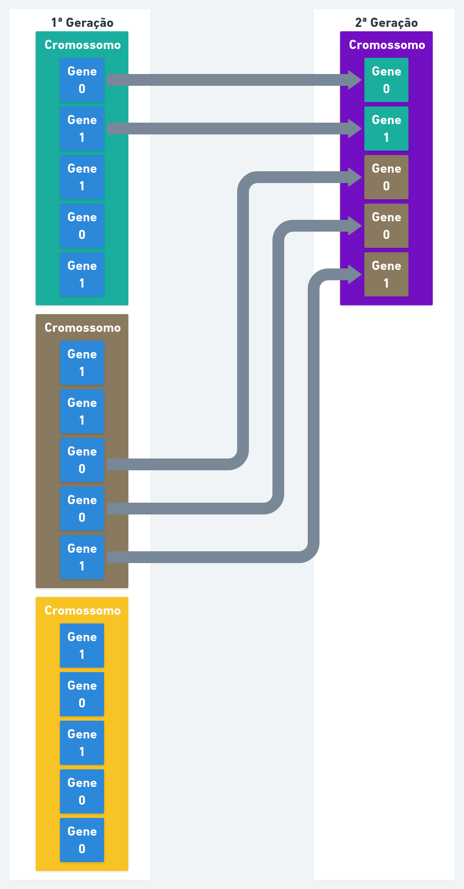
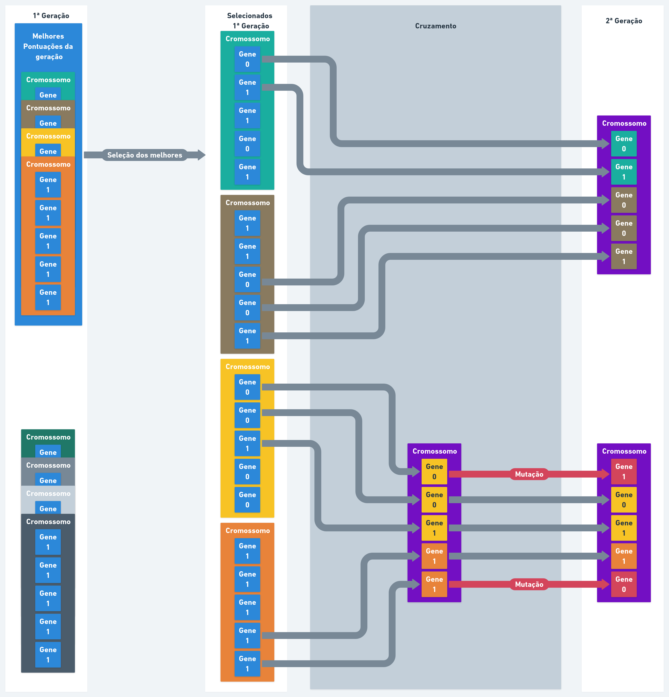

import { CodeWave } from "gatsby-theme-waves"
import GaVisualization from "./ga-visualization.js";


## Introdução

Neste primeiro post irei explicar meus entendimentos de GA (Algoritmos Genéticos), 
irei explicar de forma curta e direta, desde a teoria até exemplificação com código 
e visualização.

## Fundamentos

Irei explicar alguns conceitos básicos definhando o macro e entrando a fundo no código logo após.

##### Algoritmos Genéticos

Os Algoritmos Genéticos são uma heurística de busca, inspirada na teoria de evolução natural por *Darwin*, em que se resume a seleção natural dos "mais fortes".
Em GA, os com maiores pontuações são selecionados para reproduzir a próxima geração.

##### Geração

A geração é o resultado da procriação de uma população.

##### População

É um grupo de indivíduos resultado de uma geração, cada um contendo seu cromossomo, podendo ser resultado da procriação e mutação.

##### Indivíduo

O indivíduo é um conjunto de genes, a códificação desse conjunto de genes, pode se chamar um cromossomo.

##### Cromossomo

Um cromossomo é relacionado a herança genética, nele é contido vários genes ordenados.

##### Gene

Gene é a informação genética, responsável pelas características herdadas geneticamente.
No código, normalmente é utilizado booleans (`true` e `false`) ou inteiros (`0` e `1`) para representar a presença ou ausência de alguma característica.

##### Estrutura dos Dados



Com a imagem, deu se a entender onde os dados se encaixam, mas sem entender o algorítmo não tem como saber como chegou na segunda geração, e como foi escolhido os indivíduos.

##### Função de pontuação

A função de pontuação consiste em calcular os pontos de um indivíduo baseado em seus genes, assim podendo "competir" ou comparar cada indivíduo para que os melhores sejam selecionados.

##### Seleção

A seleção é uma etapa onde é escolhido os indivíduos as melhores pontuações, um numero par de indivíduos é o ideal ja que para próxima etapa 2 indivíduos são necessários.

##### Cruzamento

No cruzamento, a partir de 2 indivíduos é criado uma prole, que é um novo cromossomo criado aleatoriamente a partir de dois genes selecionados.

##### Mutação

Em algumas proles, alguns genes podem ser sujeitos a uma mutação com a probabilidade informada pelo algoritmo, o qual inverte o valor atual.
A mutação é util para manter a população diversificada e prevenir uniformidade dos genes nas gerações.




## Exemplificação

Para exemplificação do conteúdo estudado, vou aplicar a matéria com um trabalho.

Como trabalho da minha matéria de Inteligência Artificial, foi dado para aplicar GA para solucionar o seguinte problema:

> Você ficará isolado na natureza selvagem. A única coisa que você poderá levar é uma mochila que suporta no máximo 30 kg. Você possui diversos itens de sobrevivência, cada um possui "pontos de sobrevivência" (dados para cada item de acordo com a tabela). Seu objetivo é maximizar os pontos de sobrevivência.

##### Itens

| Item           | Peso | Pontos |
|----------------|------|--------|
| Saco de dormir | 15   |     15 |
| Corda          | 3    |      7 |
| Canivete       | 2    |     10 |
| Tocha          | 5    |      5 |
| Garrafa        | 9    |      8 |
| Comida         | 20   |     17 |

##### Código

O código abaixo foi feito com javascript.

<CodeWave>

```js
function Item(nome, peso, pontos) {
    return { nome, pontos, peso };
}
const itens = [
    
];
```
#### Configuração

Começamos definindo nossa lista de itens disponíveis vazia, e uma função para facilitar a criação deles.

```js
function Item(nome, peso, pontos) {
    return { nome, pontos, peso };
}

const itens = [
    Item("Saco de Dormir", 15, 15),
    Item("Corda", 3, 7),
    Item("Canivete", 2, 10),
    Item("Tocha", 5, 5),
    Item("Garrafa", 9, 8),
    Item("Comida", 20, 17)
];
```
Depois adicionando os itens de sobrevivência.

```js
function Item(nome, peso, pontos) {
    return { nome, pontos, peso };
}

const itens = [
    Item("Saco de Dormir", 15, 15),
    Item("Corda", 3, 7),
    Item("Canivete", 2, 10),
    Item("Tocha", 5, 5),
    Item("Garrafa", 9, 8),
    Item("Comida", 20, 17)
];

const PESO_MAXIMO = 30;

const INDIVIDUOS_POR_POPULACAO = 100;
const SELECIONADOS_POR_GERACAO = 50;
const GERACOES = 8;
const CHANCES_DE_MUTACAO = 35/100;
```
Foi definido variaveis com os parametros do problema.

No nosso algoritmo vamos definir que serão 8 gerações, sendo que terá 100 indivíduos por população e serão selecionados os 50 melhores para o cruzamento.

```js
function Item(nome, peso, pontos) {
    return { nome, pontos, peso };
}

const itens = [
    Item("Saco de Dormir", 15, 15),
    Item("Corda", 3, 7),
    Item("Canivete", 2, 10),
    Item("Tocha", 5, 5),
    Item("Garrafa", 9, 8),
    Item("Comida", 20, 17)
];

const PESO_MAXIMO = 30;

const INDIVIDUOS_POR_POPULACAO = 100;
const SELECIONADOS_POR_GERACAO = 50;
const GERACOES = 8;
const CHANCES_DE_MUTACAO = 35/100;

function cromossomoAleatorio() {
    return itens.map(_ => Math.round(Math.random()));
}

function geracaoInicial() {
    var populacaoInicial = Array(INDIVIDUOS_POR_POPULACAO).fill()
            .map(_ => cromossomoAleatorio());
    return {
        n: 1,
        populacao: populacaoInicial
    };
}


var primeiraGeracao = geracaoInicial();

```

#### Funções de apoio

`Array(100)` nos da uma lista com 100 itens vazios, com .fill() ele preenchera com "undefined", assim tornando os itens da lista iteráveis.

Com o `.map` percorremos todos os itens da nova lista vazia, retornando um numero aleatório para cada item da nossa lista `itens` (nossos itens da mochila).

`Math.random()` retorna um número aleatório de 0 a 1 podendo ser decimal, com o `Math.round` vai sempre retornar ou 0 ou 1, que é o aleatório que nós queremos.

Agora temos uma função para iniciar uma geração.

```js
function Item(nome, peso, pontos) {
    return { nome, pontos, peso };
}

const itens = [
    Item("Saco de Dormir", 15, 15),
    Item("Corda", 3, 7),
    Item("Canivete", 2, 10),
    Item("Tocha", 5, 5),
    Item("Garrafa", 9, 8),
    Item("Comida", 20, 17)
];

const PESO_MAXIMO = 30;

const INDIVIDUOS_POR_POPULACAO = 100;
const SELECIONADOS_POR_GERACAO = 50;
const GERACOES = 8;
const CHANCES_DE_MUTACAO = 35/100;

function cromossomoAleatorio() {
    return itens.map(_ => Math.round(Math.random()));
}

function geracaoInicial() {
    var populacaoInicial = Array(INDIVIDUOS_POR_POPULACAO).fill()
            .map(_ => cromossomoAleatorio());
    return {
        n: 1,
        populacao: populacaoInicial
    };
}

function evoluirGeracoes() {
    var geracaoAtual = geracaoInicial();

    while(geracaoAtual.n <= GERACOES) {
        geracaoAtual = novaGeracao(geracaoAtual);
    }
    
    return geracaoAtual;
}

function novaGeracao(ultimaGeracao) {
    return {
        n: ultimaGeracao.n + 1,
        populacao: ultimaGeracao.populacao
    };
}
```

Com a função `evoluirGeracoes` podemos agora obter a ultima geração sem 
precisar fazer qualquer tipo de loops para criar uma nova geração no meio do código.

```js
function Item(nome, peso, pontos) {
    return { nome, pontos, peso };
}

const itens = [
    Item("Saco de Dormir", 15, 15),
    Item("Corda", 3, 7),
    Item("Canivete", 2, 10),
    Item("Tocha", 5, 5),
    Item("Garrafa", 9, 8),
    Item("Comida", 20, 17)
];

const PESO_MAXIMO = 30;

const INDIVIDUOS_POR_POPULACAO = 100;
const SELECIONADOS_POR_GERACAO = 50;
const GERACOES = 8;
const CHANCES_DE_MUTACAO = 35/100;

function cromossomoAleatorio() {
    return itens.map(_ => Math.round(Math.random()));
}

function geracaoInicial() {
    var populacaoInicial = Array(INDIVIDUOS_POR_POPULACAO).fill()
            .map(_ => cromossomoAleatorio());
    return {
        n: 1,
        populacao: populacaoInicial
    };
}

function evoluirGeracoes() {
    var geracaoAtual = geracaoInicial();

    while(geracaoAtual.n <= GERACOES) {
        geracaoAtual = novaGeracao(geracaoAtual);
    }
    
    return geracaoAtual;
}

function novaGeracao(ultimaGeracao) {
    return {
        n: ultimaGeracao.n + 1,
        populacao: ultimaGeracao.populacao
    };
}

function pesoDoCromossomo(cromossomo) {
    return cromossomo.reduce((soma, atual, indice) => {
        return soma + (atual ? itens[indice].peso : 0);
    }, 0);
}

function pontuacaoDoCromossomo(cromossomo) {
    return cromossomo.reduce((soma, atual, indice) => {
        return soma + (atual ? itens[indice].pontos : 0);
    }, 0);
}

function ordenarPorPontuacao(cromossomoA, cromossomoB) {
    const pA = pontuacaoDoCromossomo(cromossomoA);
    const pB = pontuacaoDoCromossomo(cromossomoB);
    return pA > pB ? -1 :
           pA < pB ?  1 : 0;
}
```

Um requisito da seleção é saber a pontuação e ter uma função de 
ordenação dos indivíduos. Também é util ter uma função para calcular o peso, 
assim conseguimos separar os com peso correto e os melhores dentro destes.

```js
function Item(nome, peso, pontos) {
    return { nome, pontos, peso };
}

const itens = [
    Item("Saco de Dormir", 15, 15),
    Item("Corda", 3, 7),
    Item("Canivete", 2, 10),
    Item("Tocha", 5, 5),
    Item("Garrafa", 9, 8),
    Item("Comida", 20, 17)
];

const PESO_MAXIMO = 30;

const INDIVIDUOS_POR_POPULACAO = 100;
const SELECIONADOS_POR_GERACAO = 50;
const GERACOES = 8;
const CHANCES_DE_MUTACAO = 35/100;

function cromossomoAleatorio() {
    return itens.map(_ => Math.round(Math.random()));
}

function geracaoInicial() {
    var populacaoInicial = Array(INDIVIDUOS_POR_POPULACAO).fill()
            .map(_ => cromossomoAleatorio());
    return {
        n: 1,
        populacao: populacaoInicial
    };
}

function evoluirGeracoes() {
    var geracaoAtual = geracaoInicial();

    while(geracaoAtual.n <= GERACOES) {
        geracaoAtual = novaGeracao(geracaoAtual);
    }
    
    return geracaoAtual;
}

function novaGeracao(ultimaGeracao) {
    return {
        n: ultimaGeracao.n + 1,
        populacao: ultimaGeracao.populacao
    };
}

function pesoDoCromossomo(cromossomo) {
    return cromossomo.reduce((soma, atual, indice) => {
        return soma + (atual ? itens[indice].peso : 0);
    }, 0);
}

function pontuacaoDoCromossomo(cromossomo) {
    return cromossomo.reduce((soma, atual, indice) => {
        return soma + (atual ? itens[indice].pontos : 0);
    }, 0);
}

function ordenarPorPontuacao(cromossomoA, cromossomoB) {
    const pA = pontuacaoDoCromossomo(cromossomoA);
    const pB = pontuacaoDoCromossomo(cromossomoB);
    return pA > pB ? -1 :
           pA < pB ?  1 : 0;
}

function selecionarMelhores(geracao) {
    var individuosPesoCorreto = 
        geracao.populacao.filter(i => 
            pesoDoCromossomo(i) <= 
            PESO_MAXIMO
        );
    var melhores = individuosPesoCorreto
        .sort(ordenarPorPontuacao);
    if (melhores.length > SELECIONADOS_POR_GERACAO){
        melhores = melhores
            .slice(0, SELECIONADOS_POR_GERACAO);
    }
    return melhores;
}

```

Com a função de seleção, é feito um filtro dos que tem o 
peso correto utilizando a função que criamos, e pega os primeiros `50` melhores da seleção.

```js
function Item(nome, peso, pontos) {
    return { nome, pontos, peso };
}

const itens = [
    Item("Saco de Dormir", 15, 15),
    Item("Corda", 3, 7),
    Item("Canivete", 2, 10),
    Item("Tocha", 5, 5),
    Item("Garrafa", 9, 8),
    Item("Comida", 20, 17)
];

const PESO_MAXIMO = 30;

const INDIVIDUOS_POR_POPULACAO = 100;
const SELECIONADOS_POR_GERACAO = 50;
const GERACOES = 8;
const CHANCES_DE_MUTACAO = 35/100;

function cromossomoAleatorio() {
    return itens.map(_ => Math.round(Math.random()));
}

function geracaoInicial() {
    var populacaoInicial = Array(INDIVIDUOS_POR_POPULACAO).fill()
            .map(_ => cromossomoAleatorio());
    return {
        n: 1,
        populacao: populacaoInicial
    };
}

function evoluirGeracoes() {
    var geracaoAtual = geracaoInicial();

    while(geracaoAtual.n <= GERACOES) {
        geracaoAtual = novaGeracao(geracaoAtual);
    }
    
    return geracaoAtual;
}

function novaGeracao(ultimaGeracao) {
    return {
        n: ultimaGeracao.n + 1,
        populacao: ultimaGeracao.populacao
    };
}

function pesoDoCromossomo(cromossomo) {
    return cromossomo.reduce((soma, atual, indice) => {
        return soma + (atual ? itens[indice].peso : 0);
    }, 0);
}

function pontuacaoDoCromossomo(cromossomo) {
    return cromossomo.reduce((soma, atual, indice) => {
        return soma + (atual ? itens[indice].pontos : 0);
    }, 0);
}

function ordenarPorPontuacao(cromossomoA, cromossomoB) {
    const pA = pontuacaoDoCromossomo(cromossomoA);
    const pB = pontuacaoDoCromossomo(cromossomoB);
    return pA > pB ? -1 :
           pA < pB ?  1 : 0;
}

function selecionarMelhores(geracao) {
    var individuosPesoCorreto = 
        geracao.populacao.filter(i => 
            pesoDoCromossomo(i) <= 
            PESO_MAXIMO
        );
    var melhores = individuosPesoCorreto
        .sort(ordenarPorPontuacao);
    if (melhores.length > SELECIONADOS_POR_GERACAO){
        melhores = melhores
            .slice(0, SELECIONADOS_POR_GERACAO);
    }
    return melhores;
}

function cruzarIndividuos(a, b) {
    return itens.map((_, indice) => 
        Math.round(Math.random()) == 1 ?
            a[indice] : b[indice]);
}
```

A função de cruzar, pega genes aleatoriamente dos 2 indivíduos 
até juntar o necessário para ser um cromossomo.

```js
function Item(nome, peso, pontos) {
    return { nome, pontos, peso };
}

const itens = [
    Item("Saco de Dormir", 15, 15),
    Item("Corda", 3, 7),
    Item("Canivete", 2, 10),
    Item("Tocha", 5, 5),
    Item("Garrafa", 9, 8),
    Item("Comida", 20, 17)
];

const PESO_MAXIMO = 30;

const INDIVIDUOS_POR_POPULACAO = 100;
const SELECIONADOS_POR_GERACAO = 50;
const GERACOES = 8;
const CHANCES_DE_MUTACAO = 35/100;

function cromossomoAleatorio() {
    return itens.map(_ => Math.round(Math.random()));
}

function geracaoInicial() {
    var populacaoInicial = Array(INDIVIDUOS_POR_POPULACAO).fill()
            .map(_ => cromossomoAleatorio());
    return {
        n: 1,
        populacao: populacaoInicial
    };
}

function evoluirGeracoes() {
    var geracaoAtual = geracaoInicial();

    while(geracaoAtual.n <= GERACOES) {
        geracaoAtual = novaGeracao(geracaoAtual);
    }
    
    return geracaoAtual;
}

function novaGeracao(ultimaGeracao) {
    return {
        n: ultimaGeracao.n + 1,
        populacao: ultimaGeracao.populacao
    };
}

function pesoDoCromossomo(cromossomo) {
    return cromossomo.reduce((soma, atual, indice) => {
        return soma + (atual ? itens[indice].peso : 0);
    }, 0);
}

function pontuacaoDoCromossomo(cromossomo) {
    return cromossomo.reduce((soma, atual, indice) => {
        return soma + (atual ? itens[indice].pontos : 0);
    }, 0);
}

function ordenarPorPontuacao(cromossomoA, cromossomoB) {
    const pA = pontuacaoDoCromossomo(cromossomoA);
    const pB = pontuacaoDoCromossomo(cromossomoB);
    return pA > pB ? -1 :
           pA < pB ?  1 : 0;
}

function selecionarMelhores(geracao) {
    var individuosPesoCorreto = 
        geracao.populacao.filter(i => 
            pesoDoCromossomo(i) <= 
            PESO_MAXIMO
        );
    var melhores = individuosPesoCorreto
        .sort(ordenarPorPontuacao);
    if (melhores.length > SELECIONADOS_POR_GERACAO){
        melhores = melhores
            .slice(0, SELECIONADOS_POR_GERACAO);
    }
    return melhores;
}

function cruzarIndividuos(a, b) {
    return itens.map((_, indice) => 
        Math.round(Math.random()) == 1 ?
            a[indice] : b[indice]);
}

function gerarMutacao(cromossomo) {
    return cromossomo.map((gene) => {
        return (Math.random() <= CHANCES_DE_MUTACAO ?
            (gene ? 0 : 1) : gene);
    });
}

```

A função de gerar a mutação é baseada nas `CHANCES_DE_MUTACAO`, invertendo
os genes quando ocorrer a chance.

```js
function Item(nome, peso, pontos) {
    return { nome, pontos, peso };
}

const itens = [
    Item("Saco de Dormir", 15, 15),
    Item("Corda", 3, 7),
    Item("Canivete", 2, 10),
    Item("Tocha", 5, 5),
    Item("Garrafa", 9, 8),
    Item("Comida", 20, 17)
];

const PESO_MAXIMO = 30;

const INDIVIDUOS_POR_POPULACAO = 100;
const SELECIONADOS_POR_GERACAO = 50;
const GERACOES = 8;
const CHANCES_DE_MUTACAO = 35/100;

function cromossomoAleatorio() {
    return itens.map(_ => Math.round(Math.random()));
}

function geracaoInicial() {
    var populacaoInicial = Array(INDIVIDUOS_POR_POPULACAO).fill()
            .map(_ => cromossomoAleatorio());
    return {
        n: 1,
        populacao: populacaoInicial
    };
}

function evoluirGeracoes() {
    var geracaoAtual = geracaoInicial();

    while(geracaoAtual.n <= GERACOES) {
        geracaoAtual = novaGeracao(geracaoAtual);
    }
    
    return geracaoAtual;
}

function elementoAleatorio(array) {
    return array[
        Math.floor(Math.random() * array.length)
    ];
}

function novaGeracao(ultimaGeracao) {
    return {
        n: ultimaGeracao.n + 1,
        populacao: ultimaGeracao.populacao
    };
}

function pesoDoCromossomo(cromossomo) {
    return cromossomo.reduce((soma, atual, indice) => {
        return soma + (atual ? itens[indice].peso : 0);
    }, 0);
}

function pontuacaoDoCromossomo(cromossomo) {
    return cromossomo.reduce((soma, atual, indice) => {
        return soma + (atual ? itens[indice].pontos : 0);
    }, 0);
}

function ordenarPorPontuacao(cromossomoA, cromossomoB) {
    const pA = pontuacaoDoCromossomo(cromossomoA);
    const pB = pontuacaoDoCromossomo(cromossomoB);
    return pA > pB ? -1 :
           pA < pB ?  1 : 0;
}

function selecionarMelhores(geracao) {
    var individuosPesoCorreto = 
        geracao.populacao.filter(i => 
            pesoDoCromossomo(i) <= 
            PESO_MAXIMO
        );
    var melhores = individuosPesoCorreto
        .sort(ordenarPorPontuacao);
    if (melhores.length > SELECIONADOS_POR_GERACAO){
        melhores = melhores
            .slice(0, SELECIONADOS_POR_GERACAO);
    }
    return melhores;
}

function cruzarIndividuos(a, b) {
    return itens.map((_, indice) => 
        Math.round(Math.random()) == 1 ?
            a[indice] : b[indice]);
}

function gerarMutacao(cromossomo) {
    return cromossomo.map((gene) => {
        return (Math.random() <= CHANCES_DE_MUTACAO ?
            (gene ? 0 : 1) : gene);
    });
}

```

Foi feito uma função de apoio para retornar um elemento 
aleatório de um array, isso vai nos ajudar na função final.

```js
function Item(nome, peso, pontos) {
    return { nome, pontos, peso };
}

const itens = [
    Item("Saco de Dormir", 15, 15),
    Item("Corda", 3, 7),
    Item("Canivete", 2, 10),
    Item("Tocha", 5, 5),
    Item("Garrafa", 9, 8),
    Item("Comida", 20, 17)
];

const PESO_MAXIMO = 30;

const INDIVIDUOS_POR_POPULACAO = 100;
const SELECIONADOS_POR_GERACAO = 50;
const GERACOES = 8;
const CHANCES_DE_MUTACAO = 35/100;

function cromossomoAleatorio() {
    return itens.map(_ => Math.round(Math.random()));
}

function geracaoInicial() {
    var populacaoInicial = Array(INDIVIDUOS_POR_POPULACAO).fill()
            .map(_ => cromossomoAleatorio());
    return {
        n: 1,
        populacao: populacaoInicial
    };
}

function evoluirGeracoes() {
    var geracaoAtual = geracaoInicial();

    while(geracaoAtual.n <= GERACOES) {
        geracaoAtual = novaGeracao(geracaoAtual);
    }
    
    return geracaoAtual;
}

function elementoAleatorio(array) {
    return array[
        Math.floor(Math.random() * array.length)
    ];
}

function novaGeracao(ultimaGeracao) {
    var melhores = selecionarMelhores(ultimaGeracao);
    if (melhores.length % 2 != 0) {
        melhores.push(melhores[0]);
    }
    var novaPopulacao = [];
    while(novaPopulacao.length != INDIVIDUOS_POR_POPULACAO) {
        var individuoA, individuoB;

        if (melhores.length >= 2) {
            var individuoA = melhores.pop();
            var individuoB = melhores.shift();
        } else {
            var individuoA = elementoAleatorio(novaPopulacao);
            var individuoB = elementoAleatorio(novaPopulacao);
        }
        
        Array(SELECIONADOS_POR_GERACAO).fill().forEach(() => {
            var individuoC = 
                cruzarIndividuos(individuoA, 
                    individuoB);
            if (Math.random() <= CHANCES_DE_MUTACAO) {
                individuoC = gerarMutacao(individuoC);
            }
            novaPopulacao.push(individuoC);
        });
    }

    novaPopulacao = novaPopulacao.filter(cromossomo => {
        return pesoDoCromossomo(cromossomo) <= PESO_MAXIMO;
    });

    return {
        n: ultimaGeracao.n + 1,
        populacao: novaPopulacao
    };
}

function pesoDoCromossomo(cromossomo) {
    return cromossomo.reduce((soma, atual, indice) => {
        return soma + (atual ? itens[indice].peso : 0);
    }, 0);
}

function pontuacaoDoCromossomo(cromossomo) {
    return cromossomo.reduce((soma, atual, indice) => {
        return soma + (atual ? itens[indice].pontos : 0);
    }, 0);
}

function ordenarPorPontuacao(cromossomoA, cromossomoB) {
    const pA = pontuacaoDoCromossomo(cromossomoA);
    const pB = pontuacaoDoCromossomo(cromossomoB);
    return pA > pB ? -1 :
           pA < pB ?  1 : 0;
}

function selecionarMelhores(geracao) {
    var individuosPesoCorreto = 
        geracao.populacao.filter(i => 
            pesoDoCromossomo(i) <= 
            PESO_MAXIMO
        );
    var melhores = individuosPesoCorreto
        .sort(ordenarPorPontuacao);
    if (melhores.length > SELECIONADOS_POR_GERACAO){
        melhores = melhores
            .slice(0, SELECIONADOS_POR_GERACAO);
    }
    return melhores;
}

function cruzarIndividuos(a, b) {
    return itens.map((_, indice) => 
        Math.round(Math.random()) == 1 ?
            a[indice] : b[indice]);
}

function gerarMutacao(cromossomo) {
    return cromossomo.map((gene) => {
        return (Math.random() <= CHANCES_DE_MUTACAO ?
            (gene ? 0 : 1) : gene);
    });
}

```

Em fim terminamos o algoritimo com a função principal.
Garantimos que a quantidade que chegou dos melhores é par,
para que não ocorra erro ao reproduzir.
Então, nós populamos enquanto a lista não tiver a mesma
quantidade de uma população `INDIVIDUOS_POR_POPULACAO`.
Populamos com um dos melhores, e outro do fim da lista,
e caso ocorra de acabar os melhores, nós pegamos um
filho gerado aleatório da nossa nova população pela
nossa função de apoio `elementoAleatorio`.
Nós populamos com varios filhos dos dois progenitores 
selecionados, com a função de cruzamento sendo um pouco
aleatória e tendo a chance de mutação vamos ter uma grande
diversidade nos filhos, assim podendo ter uma chance alta
de uma geração menos homogênea. Terminamos verificando o
peso novamente pra ver se as mutações não geraram proles
sobrecarregadas.

```js
function Item(nome, peso, pontos) {
    return { nome, pontos, peso };
}

const itens = [
    Item("Saco de Dormir", 15, 15),
    Item("Corda", 3, 7),
    Item("Canivete", 2, 10),
    Item("Tocha", 5, 5),
    Item("Garrafa", 9, 8),
    Item("Comida", 20, 17)
];

const PESO_MAXIMO = 30;

const INDIVIDUOS_POR_POPULACAO = 100;
const SELECIONADOS_POR_GERACAO = 50;
const GERACOES = 8;
const CHANCES_DE_MUTACAO = 35/100;

function cromossomoAleatorio() {
    return itens.map(_ => Math.round(Math.random()));
}

function geracaoInicial() {
    var populacaoInicial = Array(INDIVIDUOS_POR_POPULACAO).fill()
            .map(_ => cromossomoAleatorio());
    return {
        n: 1,
        populacao: populacaoInicial
    };
}

function evoluirGeracoes() {
    var geracaoAtual = geracaoInicial();

    while(geracaoAtual.n <= GERACOES) {
        geracaoAtual = novaGeracao(geracaoAtual);
    }
    
    return geracaoAtual;
}

function elementoAleatorio(array) {
    return array[
        Math.floor(Math.random() * array.length)
    ];
}

function novaGeracao(ultimaGeracao) {
    var melhores = selecionarMelhores(ultimaGeracao);
    if (melhores.length % 2 != 0) {
        melhores.push(melhores[0]);
    }
    var novaPopulacao = [];
    while(novaPopulacao.length != INDIVIDUOS_POR_POPULACAO) {
        var individuoA, individuoB;

        if (melhores.length >= 2) {
            var individuoA = melhores.pop();
            var individuoB = melhores.shift();
        } else {
            var individuoA = elementoAleatorio(novaPopulacao);
            var individuoB = elementoAleatorio(novaPopulacao);
        }
        
        Array(SELECIONADOS_POR_GERACAO).fill().forEach(() => {
            var individuoC = 
                cruzarIndividuos(individuoA, 
                    individuoB);
            if (Math.random() <= CHANCES_DE_MUTACAO) {
                individuoC = gerarMutacao(individuoC);
            }
            novaPopulacao.push(individuoC);
        });
    }

    novaPopulacao = novaPopulacao.filter(cromossomo => {
        return pesoDoCromossomo(cromossomo) <= PESO_MAXIMO;
    });

    return {
        n: ultimaGeracao.n + 1,
        populacao: novaPopulacao
    };
}

function pesoDoCromossomo(cromossomo) {
    return cromossomo.reduce((soma, atual, indice) => {
        return soma + (atual ? itens[indice].peso : 0);
    }, 0);
}

function pontuacaoDoCromossomo(cromossomo) {
    return cromossomo.reduce((soma, atual, indice) => {
        return soma + (atual ? itens[indice].pontos : 0);
    }, 0);
}

function ordenarPorPontuacao(cromossomoA, cromossomoB) {
    const pA = pontuacaoDoCromossomo(cromossomoA);
    const pB = pontuacaoDoCromossomo(cromossomoB);
    return pA > pB ? -1 :
           pA < pB ?  1 : 0;
}

function selecionarMelhores(geracao) {
    var individuosPesoCorreto = 
        geracao.populacao.filter(i => 
            pesoDoCromossomo(i) <= 
            PESO_MAXIMO
        );
    var melhores = individuosPesoCorreto
        .sort(ordenarPorPontuacao);
    if (melhores.length > SELECIONADOS_POR_GERACAO){
        melhores = melhores
            .slice(0, SELECIONADOS_POR_GERACAO);
    }
    return melhores;
}

function cruzarIndividuos(a, b) {
    return itens.map((_, indice) => 
        Math.round(Math.random()) == 1 ?
            a[indice] : b[indice]);
}

function gerarMutacao(cromossomo) {
    return cromossomo.map((gene) => {
        return (Math.random() <= CHANCES_DE_MUTACAO ?
            (gene ? 0 : 1) : gene);
    });
}

```

#### Código Final

</CodeWave>

### Visualização

<GaVisualization />

### Créditos dos icones

<a target="_blank" href="https://icons8.com/icons/set/rucksack">Rucksack icon</a> icon by <a target="_blank" href="https://icons8.com">Icons8</a><br/>
<a target="_blank" href="https://icons8.com/icons/set/sleeping-bag">Sleeping Bag icon</a> icon by <a target="_blank" href="https://icons8.com">Icons8</a><br/>
<a target="_blank" href="https://icons8.com/icons/set/rope">Rope icon</a> icon by <a target="_blank" href="https://icons8.com">Icons8</a><br/>
<a target="_blank" href="https://icons8.com/icons/set/swiss-army-knife">Swiss Army Knife icon</a> icon by <a target="_blank" href="https://icons8.com">Icons8</a><br/>
<a target="_blank" href="https://icons8.com/icons/set/torch">Torch icon</a> icon by <a target="_blank" href="https://icons8.com">Icons8</a><br/>
<a target="_blank" href="https://icons8.com/icons/set/water-bottle">Water Bottle icon</a> icon by <a target="_blank" href="https://icons8.com">Icons8</a><br/>
<a target="_blank" href="https://icons8.com/icons/set/wrap">Wrap icon</a> icon by <a target="_blank" href="https://icons8.com">Icons8</a><br/>